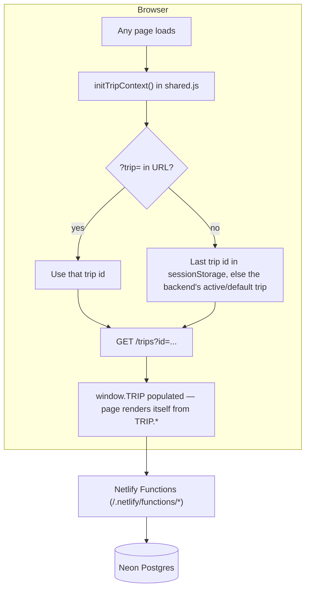
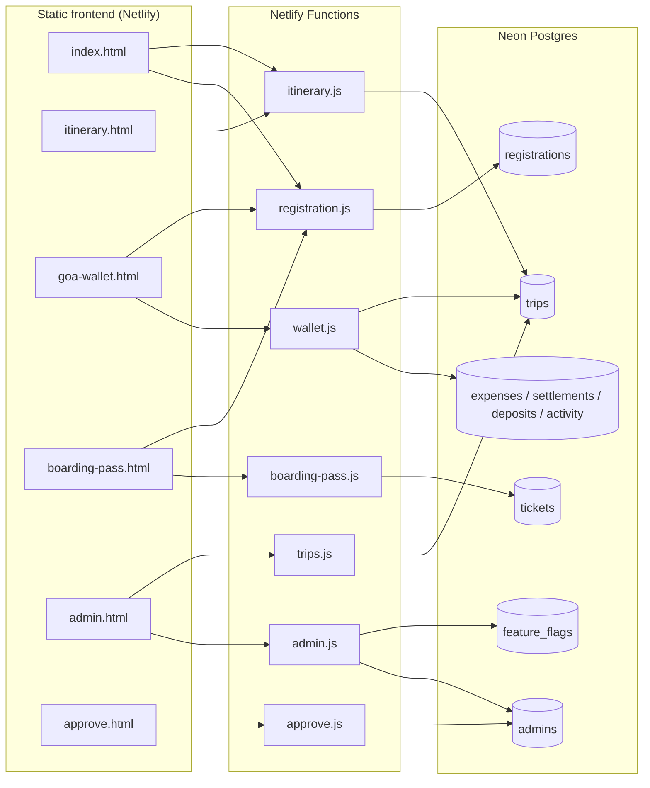

# GoaTrip — Multi-Trip Event Platform

A self-hosted, multi-tenant website for planning group trips: registration, day-by-day itinerary, a Splitwise-style shared wallet, printable train-style boarding passes, and an admin console with feature flags — all scoped to a single **trip** so the same codebase can run more than one trip/event at once.

Originally built as a single hardcoded site for "The Goa Run 2026." It has since been refactored into a **trip-agnostic platform**: every page resolves *which* trip it's showing at load time and renders itself from that trip's data, instead of having names/dates/routes baked into the HTML.

---

## ✨ Features

| Page | What it does |
|---|---|
| [`index.html`](index.html) | Public landing page — hero, gallery, journey/route section, live itinerary preview, registration form |
| [`itinerary.html`](itinerary.html) | Collaborative day-by-day itinerary editor, syncs to the shared backend |
| [`goa-wallet.html`](goa-wallet.html) | Shared expense tracker (Splitwise-style): expenses, deposits/withdrawals, settlements, balances, activity log |
| [`boarding-pass.html`](boarding-pass.html) | Passengers look up their name and get a printable, QR-coded train boarding pass |
| [`admin.html`](admin.html) | Admin console — PIN login, per-trip feature flags, trip switcher |
| [`approve.html`](approve.html) | Handles the approve/reject links sent in admin-request emails |
| [`site-hold.html`](site-hold.html) | Maintenance / "site unavailable" page |

All pages share [`shared.css`](shared.css) (design tokens, components) and [`shared.js`](shared.js) (utilities + the trip-context bootstrap described below).

---

## 🧩 How it all fits together



**The core idea:** nothing on any page is hardcoded to one trip. Every page calls `initTripContext()` once on load (from `shared.js`), which resolves *which* trip is active and fetches its config (name, dates, route, itinerary defaults, wallet participants, categories, etc.) into a global `window.TRIP` object. Everything else — page titles, the departure board, feature flags, wallet data, boarding passes — is scoped by `TRIP.id` for every backend call.

### Trip resolution order
1. `?trip=<id>` query parameter (explicit override, e.g. shared links)
2. The last trip id remembered in `sessionStorage` (so navigating between pages keeps you on the same trip)
3. Whichever trip the backend has marked `is_active` (the site's default, for bare URLs / old QR codes)

---

## 🏗️ Architecture



Every table except `admins` carries a `trip_id` column — that's what makes the platform multi-tenant. `admins` is intentionally **global**: one set of admin logins manages every trip (feature flags, itinerary edits, etc. are still scoped per trip via `trip_id`).

### Why this stack
- **Netlify Functions** — serverless, deploys with the static site, no separate hosting to manage.
- **Neon Postgres** — real relational multi-tenancy (`trip_id` foreign keys, transactions, indexes) instead of the original Google Sheets/Apps Script backend, which had no real way to isolate multiple trips' data from each other.
- **Resend** — transactional email for the admin request → approve/reject flow.

---

## 📁 Project structure

```
GoaTrip/
├─ index.html, itinerary.html, goa-wallet.html,      ← static pages
│  boarding-pass.html, admin.html, approve.html,
│  site-hold.html
├─ shared.css, shared.js                              ← design tokens, utilities, trip-context bootstrap
├─ netlify/
│  └─ functions/
│     ├─ trips.js            ← list/get/create/update trips, set active trip
│     ├─ registration.js     ← registration open/closed, submit registration, participant list
│     ├─ itinerary.js        ← get/save the itinerary JSON blob
│     ├─ wallet.js           ← expenses, settlements, deposits, activity log (full CRUD)
│     ├─ boarding-pass.js    ← ticket lookup by trip + passenger name
│     ├─ admin.js            ← admin login/PIN, feature flags, request-admin flow
│     ├─ approve.js          ← approve/reject admin-request email links
│     └─ lib/
│        ├─ db.js            ← Neon Postgres connection pool
│        ├─ http.js          ← response helpers (json/ok/badRequest/...)
│        ├─ validate.js      ← input sanitization + schema validation
│        ├─ auth.js          ← PIN hashing (scrypt) + signed session tokens
│        ├─ flags.js         ← feature-flag lookup helper
│        └─ mailer.js        ← Resend email wrapper
├─ netlify.toml                                        ← headers, CSP, functions config
├─ package.json                                        ← Netlify Functions dependencies
└─ pictures/, videos/                                  ← static assets
```

---

## 🔐 Data model (Neon Postgres)

| Table | Scope | Purpose |
|---|---|---|
| `trips` | — | One row per trip: name, dates, route, default itinerary, gallery places, wallet categories, `is_active` flag |
| `registrations` | per trip | Who signed up (name, phone, email, food pref, notes) — also the source of truth for wallet participants |
| `itinerary_json` *(column on `trips`)* | per trip | The current saved itinerary, edited from `itinerary.html` |
| `expenses` / `settlements` / `deposits` / `activity` | per trip | Wallet data |
| `tickets` | per trip | Boarding-pass journey legs per passenger |
| `feature_flags` | per trip | On/off switches admins can toggle per page/feature |
| `admins` | global | Admin accounts (name, email, hashed PIN, lockout state) — shared across every trip |

---

## 🔄 Key workflows

**Registering for a trip:** `index.html` → `POST /registration` (gated by the trip's `registration_open` flag *and* the `index.registration` feature flag) → row inserted into `registrations` → the wallet and boarding-pass pages automatically see the new name on their next sync.

**Planning the itinerary:** `itinerary.html` loads the saved `itinerary_json` for the trip (falling back to `TRIP.defaultItinerary` if nothing's saved yet) → edits are pushed back via `POST /itinerary` (gated by the `itinerary.editing` feature flag) → `index.html`'s itinerary preview picks up the same data on next load.

**Splitting expenses:** `goa-wallet.html` pulls the full wallet snapshot from `GET /wallet?tripId=...` and pushes every add/edit/delete through `POST /wallet`. Every write is schema-validated server-side before it touches the database. Renaming or removing a participant, or applying a manual balance correction, requires being logged into `admin.html` first (verified via a real session token, not a hardcoded name list).

**Generating a boarding pass:** passenger types their name on `boarding-pass.html` → `GET /boarding-pass?tripId=...&name=...` returns their journey legs (matched case-insensitively) → rendered as a printable pass with a QR code.

**Admin access:** a new admin requests access on `admin.html` → an email goes to the trip's approver with approve/reject links → clicking approve emails the new admin a temporary 6-digit PIN → their first login forces a permanent PIN change. Logins are protected by a lockout after repeated wrong PINs. Feature flags are then toggled per trip from the same dashboard.

---

## 🚀 Adding a new trip

There's no self-serve "create trip" UI yet. For now, insert a new row into the `trips` table with the same shape as the existing one (name, dates, origin/destination/waypoint, `default_itinerary`, `gallery_places`, `route_legs`, `categories`, participant count) and share links with `?trip=<new-id>` — or mark it `is_active` to make it the site's default.

---

## 🛠️ Local development

```bash
npm install
```

You'll need these environment variables set (locally via `netlify env:set` / a `.env` the Netlify CLI reads, and in the Netlify dashboard for production — **never commit real values to the repo**):

| Variable | Purpose |
|---|---|
| `DATABASE_URL` | Neon Postgres connection string |
| `SESSION_SECRET` | Signs admin session tokens (any long random string) |
| `RESEND_API_KEY` | Sends admin request/approval emails |
| `MAIL_FROM` | *(optional)* From-address for outgoing email |
| `SITE_BASE_URL` | The site's public URL, used to build approve/reject links |
| `APPROVER_EMAIL` | Where admin access requests get emailed |
| `WALLET_RESET_CONFIRM_PHRASE` | *(optional)* Confirmation phrase required to wipe a trip's wallet |

```bash
netlify dev   # runs the static site + Netlify Functions together
```

## 🔒 Security notes

- Admin PINs are hashed with `scrypt` (salted, one-way) — never stored or logged in plaintext.
- Admin sessions are stateless, HMAC-signed tokens with a 12-hour expiry.
- Every wallet/registration input is sanitized and schema-validated server-side before it's written to the database — a malformed or malicious request never reaches Postgres.
- The database connection string only ever lives server-side (Netlify Functions), never in client-side code.
- A Content-Security-Policy is enforced site-wide via `netlify.toml`.
